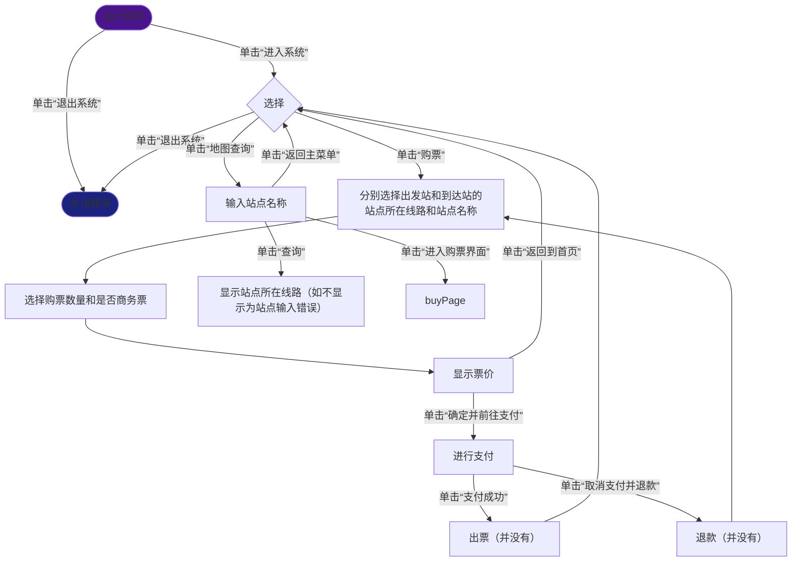

# SimulationTicketingSystem_ShenzhenMetro

——哈尔滨工业大学（深圳）创新训练课B 课程设计（**模拟地铁自动售票系统**）文档

**********************************************************


## 目录

1. 简介
2. 部署
3. 使用教程
5. 联系作者

*************************************************************


## 1 简介

这是哈尔滨工业大学（深圳）创新训练课B 课程设计——模拟地铁自动售票系统的使用文档

本项目是一个模拟深圳地铁自动售票系统的桌面应用程序（以下简称“系统”），旨在帮助学生理解地铁售票系统的工作原理和软件开发流程。系统实现了地铁票务购买、支付、站点查询等核心功能，并集成了MySQL数据库用于存储交易记录。


## 2 部署

### 2.1 系统主体部署

#### 2.1.1 .exe程序自动部署（Windows平台）

#### 2.1.2 使用.zip部署


### 2.2 MySQL部署

#### 2.2.1 MySQL环境部署

可参考 【一小时MySQL教程】 https://www.bilibili.com/video/BV1AX4y147tA/?p=5&share_source=copy_web&vd_source=4794a59d02902101b6ba8049331c6851 进行MySQL环境配置

**（注意：系统使用的端口号为3306！）**

可参考 [MySQL的详细使用教程-CSDN博客](https://blog.csdn.net/m0_67444449/article/details/144631074) 进行SQL语法学习

MySQL官方文档： [MySQL :: MySQL 8.4 Reference Manual](https://dev.mysql.com/doc/refman/8.4/en/) 

#### 2.2.2 创建数据库

首次使用本模拟系统时，输入密码，进入系统后，执行：

``` SQL
create database financialRecord;
```

即可，无需自行创建工作表。


## 3 使用教程

### 3.1 流程图




### 3.2 更新地铁线路或票价表

访问 [行政事业性收费-深圳市发展和改革委员会网站](https://fgw.sz.gov.cn/fzgggz/jgzcgl/xzsyxsf/) 查询深圳市发改委公告，下载表格附件

替换系统根目录下 /CostSheet 中的两个表格即可，注意修改表格文件名，使其与原表格文件名对应相同

示例：/CostSheet 目录下文件（文件名和目录有可能不同）


## 4 联系作者

email: drinkermicawber@qq.com

Github: [DrinkerqvB/SimulationTicketingSystem_ShenzhenMetro](https://github.com/DrinkerqvB/SimulationTicketingSystem_ShenzhenMetro)

